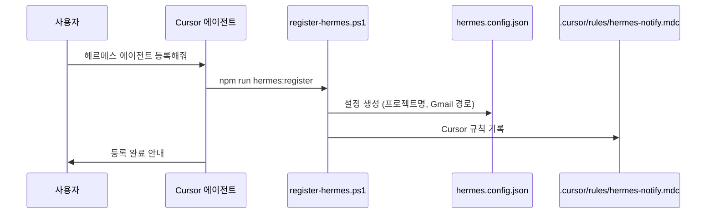
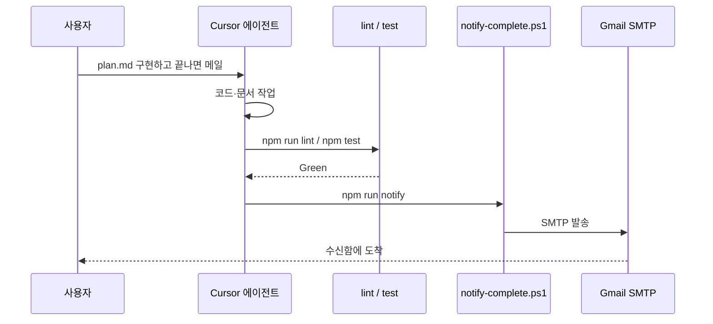

# Hermes — 작업 완료 Gmail 알림

**Hermes**(헤르메스)는 이 프로젝트에서 **「작업이 끝나면 Gmail로 알려 주는 메신저」** 역할의 로컬 설정 이름입니다.

> NousResearch의 [Hermes Agent](https://github.com/NousResearch/hermes-agent)(`hermes acp`)와는 **다른 것**입니다. IDE에 Hermes CLI를 깔 필요 없습니다.  
> 제품 Wiki 주제: [/topics/nous-hermes-agent](/topics/nous-hermes-agent)

---

## 「헤르메스 에이전트 등록해줘」라고 하면?



1. **에이전트**가 `npm run hermes:register` 를 실행합니다.
2. **`hermes.config.json`** 이 생깁니다 (Gmail 비밀번호는 넣지 않음 → `../gemini_tuner/gmail_config.json` 참조).
3. **`.cursor/rules/hermes-notify.mdc`** 가 있어, 이후 채팅에서도 「작업 끝나면 메일」 요청을 기억합니다.

---

## 「작업 끝나면 지메일로 알려줘」라고 하면?



1. 요청한 **구현·이관** 등을 수행합니다.
2. **검증**(`lint`, `test`)이 있으면 먼저 돌립니다.
3. 성공하면 **`npm run notify`** → `scripts/notify-complete.ps1` → Gmail.

---

## 수동 명령

```powershell
# 1회 등록
npm run hermes:register

# 완료 알림 (기본 제목·본문)
npm run notify

# 제목·본문 지정
npm run notify -- -Subject "[AI-Synapse Wiki] 커스텀" -Body "상세 내용"
```

---

## 설정 파일

| 파일 | 설명 |
|------|------|
| `hermes.config.example.json` | 템플릿 (커밋 가능) |
| `hermes.config.json` | 실제 설정 (gitignore, 로컬만) |
| `../gemini_tuner/gmail_config.json` | sender / app_pw / receiver |

---

## 문제 해결

| 증상 | 조치 |
|------|------|
| Hermes 미등록 | `npm run hermes:register` |
| Gmail 설정 없음 | `gemini_tuner/gmail_config.json` 확인 |
| Drive에서 npm 실패 | `notify`는 **PowerShell만** 사용 → Drive에서도 동작 |
