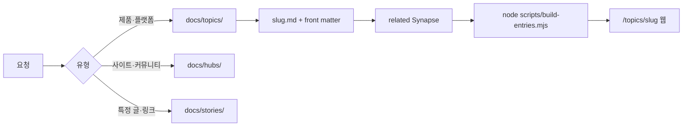

# 새 용어 · 제품 Wiki 등록 가이드

## 왜 지금 주제들이 어색해 보이나?

v0.1 초기 데이터는 **`Ai-Synapse` 파이프라인 이관용 카드**입니다.

- 스토리 URL이 `gpters.org/p/example1` 등 **플레이스홀더**
- **주제(topic)** 는 Antigravity·하네스처럼 **정의·맥락이 있는 엔트리**만 둡니다. 에이전트·프롬프트 엔지니어링·RAG 주제는 포맷 불일치로 **삭제**됨.
- **하네스 엔지니어링**, 앞으로 넣는 **Antigravity 2.0**처럼 **직접 작성한 엔트리**가 “위키다운” 기준

즉, 구조는 Wiki가 맞고, **내용을 채우는 방식**이 아직 이관 단계에 가깝습니다.

---

## 「○○을 등록해줘」라고 하면 (에이전트 동작)

예: **「안티그래비티 2.0을 등록해줘!!」**



| 단계 | 하는 일 |
|------|---------|
| 1 | **유형 선택** — 제품/개념 → `topics/` · 사이트 → `hubs/` · 글 → `stories/` |
| 2 | **Wiki 주소** (slug) — `antigravity-2` (영문·하이픈, URL·파일명) |
| 3 | **MD 작성** — 정의, 왜 중요한지, 공식 URL, 관련 용어 |
| 4 | **Synapse** — `related`에 기존 topic/hub 연결 + 역링크 |
| 5 | **빌드** — `node scripts/build-entries.mjs` |
| 6 | **확인** — `npm run start` → 브라우저 |

### 관리 UI — 자연어 등록 (v0.2)

`/admin/topics/register` (자연어 · 수동 탭) — 「제미나이 등록해줘」처럼 입력 → Wiki 포맷 **초안** → 확인 후 발행.

| 경로 | 누가 쓰나 | 포맷 |
|------|-----------|------|
| **Cursor 채팅** 「○○ 등록해줘」 | 에이전트가 `docs/topics/*.md` 직접 작성 | Antigravity·Claude Code 수준 (기준) |
| **관리 → 자연어 등록** | `topic-nl-generate.mjs` | API 키·규칙에 따라 다름 |
| **관리 → 수동 등록** | 사용자가 폼 입력 | 사용자 작성 그대로 |

- `WIKI_TOPIC_LLM_API_KEY` **없음** → Gemini API **미호출**. 제미나이는 예전에 `new-topic` + 「채워 주세요」 템플릿이었음.
- `WIKI_TOPIC_LLM_API_KEY` **있음** → 초안 `mode: llm` (Gemini JSON). dev **재시작** 필수.
- 규칙 초안: Nous Hermes Agent, Gmail Hermes(알림), ChatGPT, Gemini, Claude Code, Antigravity, 하네스 이름 매칭
- 제목에 **영문·한글**이 함께 있으면 등록 제목·Wiki 주소(slug)는 **영문 우선** (예: `클로드 코드 Claude Code` → `Claude Code`)

### 주제 목록 — 편집 · 삭제

`/admin/topics` 목록에서 **편집** · **삭제** (dev API: `PUT` / `DELETE` `/api/admin/topics/{slug}`).

- 삭제: `docs/topics/{slug}.md` 제거 + `build-entries`
- 편집: visibility·본문·연관 주제 수정 (slug 변경은 미지원)

### 보호 모드 (삭제 비활성)

**주제 목록** (`/admin/topics`) 표의 **관리** 열 헤더에 **보호 ON/OFF** 스위치 — 설정은 `.wiki-admin-settings.json` 에 저장 (git 제외).

- 켜면: 상단 배너, 목록·편집에서 **삭제** 숨김, `DELETE` API 403
- `.env` 의 `VITE_ADMIN_PROTECT=true` 는 **강제 ON** (스위치 비활성, `.env 고정` 표시)
- API 없음 + 미등록 키워드 → **템플릿 골격**만 나옴 (`한 줄 설명을 채워 주세요`, slug `new-topic` 가능) → **이상해 보이는 주된 이유**
- 규칙 등록됨: Hermes, **Claude Code**, Antigravity, 하네스 (이름만 맞으면 본문 채움)

## Wiki 포맷을 다시 잡을 필요가 있나?

**아니요.** `_templates/topic.md` 구조(한 줄 정의 · 왜 Wiki · 핵심 · 관련 · 출처)는 [Antigravity 2.0](/topics/antigravity-2) 기준으로 이미 맞습니다.

| 문제 | 원인 | 대응 |
|------|------|------|
| 본문이 비어 있음 | API 없이 **generic** 초안만 발행 | 초안 화면에서 본문 채운 뒤 발행, 또는 API 키 |
| URL이 `/topics/new-topic` | 한글 제목 → Wiki 주소 영문 추출 실패 | Wiki 주소를 `claude-code` 등으로 수정 |
| 카드처럼 느껴짐 | 플레이스홀더 그대로 저장 | 위 표 참고 |

**좋은 주제** = 제품/개념 1개 + 공식 URL + 표 1개 이상이 **실제 내용** + Synapse 2개 이상.

---

## 당신이 채팅에 넣으면 좋은 정보

한 줄만 말해도 되지만, 아래를 주면 품질이 올라갑니다.

```text
안티그래비티 2.0을 topic으로 등록해줘.
- 정의: Google의 에이전트 우선 개발 환경 (데스크톱 + CLI)
- URL: https://antigravity.google/
- 연결: harness-engineering, agy CLI
```

---

## 파일 템플릿

`docs/_templates/topic.md` 참고. 최소 필드는 `docs/META.md`와 동일합니다.

---

## 수동 등록 (직접)

1. `docs/topics/내-용어.md` 생성  
2. `docs/index.md` 「최근 추가」 한 줄  
3. `node scripts/build-entries.mjs`  
4. (선택) `npm run start`
